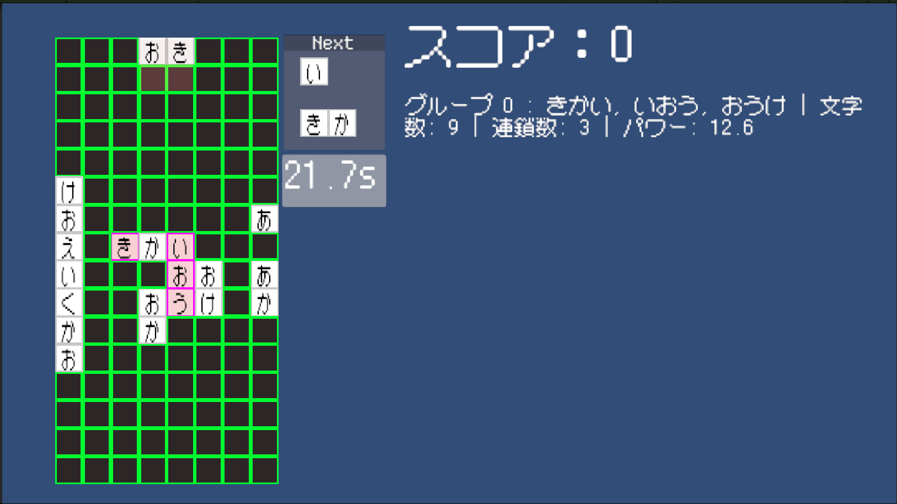

ゲーム制作技術総合実習 個人ワーク
（Circle, Triangle, Squareを使用した2Dゲーム）

# ここにゲームのタイトルを記述する
CrosSpell

## ゲームの内容
クロスワードを作って連鎖させる（対戦）パズルゲーム

## 操作説明
・矢印キーもしくはWASDキーで移動
・スペースキーで回転　赤いブロックは文字切り替え
・EnterキーもしくはEキーで配置
・Qキーで作った単語・クロスワードを消去しスコア化
・単語を作ってクロスワードを組む　
　#のような形で組むとメビウス（高得点の役）
　6文字以上の単語二つでグランドクロス（高得点の役）
・グリッドが全部埋まると負け
